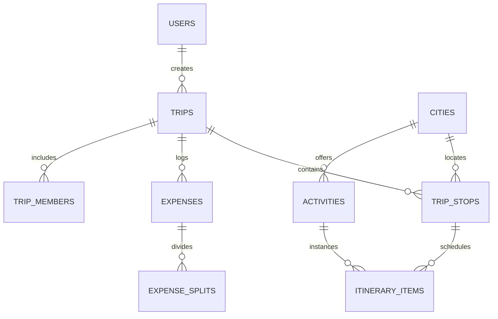

# 🌍 GlobeTrotter — Empowering Personalized Travel Planning

> **Odoo Hackathon Solution** | Intelligent Multi-City Travel Planner with Relational Architecture, Geospatial AI Optimization, and Multi-Currency Expense Settlement.

---

## 📖 Executive Summary & Problem Statement

Planning multi-city international travel is traditionally fragmented across dozens of disconnected browser tabs, confusing currency conversions, inefficient routes, and messy spreadsheets.

**GlobeTrotter** is a personalized, intelligent, and collaborative platform that transforms how travelers design, visualize, and budget multi-city journeys. Built on a clean **relational database architecture**, the platform provides day-by-day scheduling, interactive route mapping, dynamic currency conversion, and group expense settlement.

---

## 🌟 Key "WOW Factors" & Innovations

### 1. 💰 GlobeSplit — Multi-Currency Debt Settlement Engine
* **The Problem:** Multi-country trips involve transactions in multiple currencies (EUR, USD, JPY, GBP, INR) and complicated group debts.
* **Our Solution:** A built-in financial settlement engine utilizing a **Min-Cash-Flow graph algorithm**. It normalizes multi-currency expenses using live FX rates and calculates the **exact minimum number of transactions** to settle all debts among friends.

### 2. ✨ Smart Route Optimizer — Geospatial TSP AI Engine
* **The Problem:** Travelers often schedule activities in random order, wasting hours in transit and crisscrossing cities.
* **Our Solution:** An algorithmic scheduler solving the **Travelling Salesperson Problem (TSP)** using Haversine great-circle formulas and 2-Opt local search. With one click, it automatically re-orders a day's schedule to minimize transit distance and travel time.

### 3. 🔗 1-Click Community Trip Cloning ("Fork Trip")
* Discover community-curated itineraries and clone the entire multi-city plan, activities, and budgets into your personal account in one click.

---

## 🏗️ Relational Database Architecture



---

## 📱 Complete 13 Screen Implementation

| Screen # | Name | Key Functionality |
| :---: | :--- | :--- |
| **1** | **Login / Signup** | Secure JWT authentication, bcrypt password hashing, session management |
| **2** | **Dashboard / Home** | Welcome hub, recent trips, platform stats, trending destination cards |
| **3** | **Create Trip** | Form for trip name, date ranges, total budget, and cover photo |
| **4** | **My Trips (Trip List)** | Trip overview cards with destination counts, date ranges, and spent status |
| **5** | **Itinerary Builder** | Multi-city destination sequencer, add custom items, and assign activities |
| **6** | **Itinerary View** | Structured day-by-day timeline with time slots, duration, and costs |
| **7** | **City Search** | Global destination search with cost indexes, popularity, and filters |
| **8** | **Activity Search** | Things-to-do discovery categorized by Sightseeing, Culture, Food, Adventure |
| **9** | **Trip Budget & Breakdown**| Category expense breakdown (Stay, Transport, Food, Activities) + GlobeSplit matrix |
| **10** | **Trip Calendar / Timeline**| Visual timeline paired with interactive Leaflet GIS route map |
| **11** | **Public Share & Clone** | Public shareable URL slug + 1-click **"Fork / Copy Trip"** duplication |
| **12** | **User Profile / Settings** | Base currency preferences (USD, EUR, INR, GBP), profile details |
| **13** | **Admin Analytics** | Platform metrics, top visited cities, and activity category distribution |

---

## 🛠️ Tech Stack

* **Frontend:** React 18 (Standalone SPA), Tailwind CSS, Lucide Icons, Leaflet GIS Maps, Chart.js
* **Backend:** FastAPI (Python 3.10+), SQLAlchemy ORM, Pydantic v2, Python-Jose (JWT), Passlib (Bcrypt)
* **Database:** Relational SQLite / PostgreSQL
* **Algorithms:** Travelling Salesperson Problem (2-Opt TSP), Min-Cash-Flow Greedy Solver, Haversine Distance

---

## 🚀 Quick Start & Installation

### 1. Clone the Repository
```bash
git clone https://github.com/<YOUR-USERNAME>/GlobeTrotter.git
cd GlobeTrotter
```

### 2. Install Dependencies
```bash
pip install -r requirements.txt
```

### 3. Start the Application
```bash
python -m uvicorn main:app --reload --port 8000
```

### 4. Open in Browser
* **Interactive Web App:** [http://localhost:8000](http://localhost:8000)
* **Interactive API Docs (Swagger):** [http://localhost:8000/docs](http://localhost:8000/docs)

---

## 🧪 Automated Testing
Run the backend and algorithmic test suite:
```bash
python test_backend.py
```

---

## 👥 Hackathon Team
* Developed for the **Odoo Hackathon**
